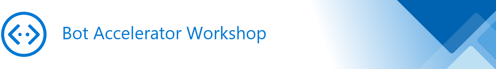

<link  rel="stylesheet" type="text/css" href="./CSS/Markdown.css" />

# Overview

This workshop will guide you step-by-step through the process of developing an enterprise bot using the Microsoft Bot Framework and the Azure Bot Service.  It's designed to acclerate the development of a Minimal Viable Product (MVP) while minimizing the time-to-value.  So this workshop  **IS NOT** about how to build **A BOT** , it's about how to build **YOUR BOT**!  Think of it as the first sprint of your bot's MVP milestone.  

Although you'll only execute the **Plan** and **Build** phases in this workshop, you can use the links in the the [master plan](#MAsterPlan) below to guide you through the remaining phases and accelerate your bot journey all the way through to production deployment.

&nbsp;&nbsp;&nbsp;&nbsp;&nbsp;

### Plan&nbsp;&nbsp;&nbsp;&nbsp;&nbsp;&nbsp;&nbsp;&nbsp;&nbsp;&nbsp;&nbsp;&nbsp;&nbsp;&nbsp;&nbsp;&nbsp;&nbsp;&nbsp;&nbsp;&nbsp;&nbsp;Build&nbsp;&nbsp;&nbsp;&nbsp;&nbsp;&nbsp;&nbsp;&nbsp;&nbsp;&nbsp;&nbsp;&nbsp;&nbsp;&nbsp;&nbsp;&nbsp;&nbsp;&nbsp;Test&nbsp;&nbsp;&nbsp;&nbsp;&nbsp;&nbsp;&nbsp;&nbsp;&nbsp;&nbsp;&nbsp;&nbsp;&nbsp;&nbsp;&nbsp;&nbsp;&nbsp;&nbsp;&nbsp;Publish&nbsp;&nbsp;&nbsp;&nbsp;&nbsp;&nbsp;&nbsp;&nbsp;&nbsp;&nbsp;&nbsp;&nbsp;&nbsp;Manage&nbsp;&nbsp;&nbsp;&nbsp;&nbsp;&nbsp;&nbsp;&nbsp;&nbsp;&nbsp;&nbsp;&nbsp;&nbsp;&nbsp;&nbsp;&nbsp;Learn  
##### Workshop Prerequisites  
##### Identify Scenarios  
##### Design Conversational AI
##### Define Actions, Review Guidance

# Contents

[Overview](#Overview)  
[Plan](#Plan)  
&nbsp;&nbsp;&nbsp;&nbsp;&nbsp;[Workshop Prechecks and Prerequisites](#WorkshopPrechecksandPrerequisites)  
&nbsp;&nbsp;&nbsp;&nbsp;&nbsp;[Identify Scenarios](#IdentifyScenarios)  
&nbsp;&nbsp;&nbsp;&nbsp;&nbsp;[Author Dialog, Design Cards, and Visualize](#AuthorDialogDesignCardsandVisualize)  
&nbsp;&nbsp;&nbsp;&nbsp;&nbsp;[(Post Workshop) Define Actions and Supporting Activities](#DefineActionsandSupportingActivities)  
&nbsp;&nbsp;&nbsp;&nbsp;&nbsp;[(Post Workshop) Review Design Guidelines](#ReviewDesignGuidelines)  
[Build](#Build)  
&nbsp;&nbsp;&nbsp;&nbsp;&nbsp;[Preface - Conversational AI fundamentals and Motivation](#ConversationalAIfundamentalsandMotivation)  
&nbsp;&nbsp;&nbsp;&nbsp;&nbsp;[Step 1 - Create Your Virtual Assistant](#CreateYourVirtualAssistant)  
&nbsp;&nbsp;&nbsp;&nbsp;&nbsp;&nbsp;&nbsp;&nbsp;&nbsp;&nbsp;[Step 1.1 - Create, Deploy, and Run Your Virtual Assistant](#CreateDeployandRunYourVirtualAssistant)  
&nbsp;&nbsp;&nbsp;&nbsp;&nbsp;&nbsp;&nbsp;&nbsp;&nbsp;&nbsp;[Step 1.2 - Update NuGet Packages](#UpdateNuGetPackages)  
&nbsp;&nbsp;&nbsp;&nbsp;&nbsp;&nbsp;&nbsp;&nbsp;&nbsp;&nbsp;[Step 1.3 – Add Source Code to Local Git Repo](#AddSourceCodetoLocalGitRepo)  
&nbsp;&nbsp;&nbsp;&nbsp;&nbsp;[Step 2 - Customize your Virtual Assistant](#Step2CustomizeyourVirtualAssistant)  
&nbsp;&nbsp;&nbsp;&nbsp;&nbsp;[Step 3 - Update QnA Maker Knowledge Base (KB)](#Step3UpdateQnAMakerKnowledgeBaseKB)  
&nbsp;&nbsp;&nbsp;&nbsp;&nbsp;&nbsp;&nbsp;&nbsp;&nbsp;&nbsp;[Step 3.1 – Edit "faq" Knowledge Base Name](#Step31EditfaqKnowledgeBaseName)  
&nbsp;&nbsp;&nbsp;&nbsp;&nbsp;&nbsp;&nbsp;&nbsp;&nbsp;&nbsp;[Step 3.2 – Delete Default Content](#Step32DeleteDefaultContent)  
&nbsp;&nbsp;&nbsp;&nbsp;&nbsp;&nbsp;&nbsp;&nbsp;&nbsp;&nbsp;[Step 3.3 – Add QnA pair](#Step33AddQnApair)  
&nbsp;&nbsp;&nbsp;&nbsp;&nbsp;&nbsp;&nbsp;&nbsp;&nbsp;&nbsp;[Step 3.4 – Add Alternate Questions](#Step34AddAlternateQuestions)  
&nbsp;&nbsp;&nbsp;&nbsp;&nbsp;&nbsp;&nbsp;&nbsp;&nbsp;&nbsp;[Step 3.5 – Add Metadata to Questions](#Step35AddMetadatatoQuestions)  
&nbsp;&nbsp;&nbsp;&nbsp;&nbsp;&nbsp;&nbsp;&nbsp;&nbsp;&nbsp;[Step 3.6 – Turn on Active Learning](#Step36TurnonActiveLearning)  
&nbsp;&nbsp;&nbsp;&nbsp;&nbsp;&nbsp;&nbsp;&nbsp;&nbsp;&nbsp;[Step 3.7 – Update Your Local Models](#Step37UpdateYourLocalModels)  
&nbsp;&nbsp;&nbsp;&nbsp;&nbsp;&nbsp;&nbsp;&nbsp;&nbsp;&nbsp;[(Optional) Collaborate](#OptionalCollaborate)  
&nbsp;&nbsp;&nbsp;&nbsp;&nbsp;[Step 4 - Add Your Core Skill](#Step4AddYourCoreSkill)  
&nbsp;&nbsp;&nbsp;&nbsp;&nbsp;&nbsp;&nbsp;&nbsp;&nbsp;&nbsp;[Step 4.1 – Create, Deploy, and Run Your Core Skill](#Step41CreateDeployandRunYourCoreSkill)  
&nbsp;&nbsp;&nbsp;&nbsp;&nbsp;&nbsp;&nbsp;&nbsp;&nbsp;&nbsp;[Step 4.2 - Update NuGet Packages](#Step42UpdateNuGetPackages)  
&nbsp;&nbsp;&nbsp;&nbsp;&nbsp;[Step 5 - Implement Your Skill's Core Scenario](#Step5ImplementYourSkillsCoreScenario)  
&nbsp;&nbsp;&nbsp;&nbsp;&nbsp;&nbsp;&nbsp;&nbsp;&nbsp;&nbsp;[Step 5.1 - Add LUIS Intent in the LUIS portal](#Step51AddLUISIntentintheLUISportal)  
&nbsp;&nbsp;&nbsp;&nbsp;&nbsp;&nbsp;&nbsp;&nbsp;&nbsp;&nbsp;[Step 5.2 - Update Skill and Assistant to include new Intent](#Step52UpdateSkillandAssistanttoincludenewIntent)  
&nbsp;&nbsp;&nbsp;&nbsp;&nbsp;&nbsp;&nbsp;&nbsp;&nbsp;&nbsp;[Step 5.3 - Update Skill to Act on Intent and Begin Dialog with User](#Step53UpdateSkilltoActonIntentandBeginDialogwithUser)  
&nbsp;&nbsp;&nbsp;&nbsp;&nbsp;[Step 6 - (Optional) Add Multiturn QnA Prompts to Your Assistant](#Step6OptionalAddMultiturnQnAPromptstoYourAssistant)  
&nbsp;&nbsp;&nbsp;&nbsp;&nbsp;[Step 7 - (Optional) Add a Built-in Skill to Your Virtual Assistant](#Step7OptionalAddaBuiltinSkilltoYourVirtualAssistant)  
&nbsp;&nbsp;&nbsp;&nbsp;&nbsp;&nbsp;&nbsp;&nbsp;&nbsp;&nbsp;[(Optional) What do these parameters mean?](#OptionalWhatdotheseparametersmean)  
&nbsp;&nbsp;&nbsp;&nbsp;&nbsp;[Step 8 - Wrapping Up Build Stage](#Step8WrappingUpBuildStage)  
&nbsp;&nbsp;&nbsp;&nbsp;&nbsp;&nbsp;&nbsp;&nbsp;&nbsp;&nbsp;[Changing Endpoint](#ChangingEndpoint)  
&nbsp;&nbsp;&nbsp;&nbsp;&nbsp;&nbsp;&nbsp;&nbsp;&nbsp;&nbsp;[Adding Secure Web Chat Control](#AddingSecureWebChatControl)  
&nbsp;&nbsp;&nbsp;&nbsp;&nbsp;&nbsp;&nbsp;&nbsp;&nbsp;&nbsp;[Configure DevOps](#ConfigureDevOps)  
&nbsp;&nbsp;&nbsp;&nbsp;&nbsp;&nbsp;&nbsp;&nbsp;&nbsp;&nbsp;[Unit Testing Bots (to complete CI/CD pipeline)](#UnitTestingBotstocompleteCICDpipeline)  
&nbsp;&nbsp;&nbsp;&nbsp;&nbsp;&nbsp;&nbsp;&nbsp;&nbsp;&nbsp;[Analyzing Bot Usage](#AnalyzingBotUsage)  
[Appendix – Important Links](#AppendixImportantLinks)  
[Appendix – Publish Virtual Assistant or Skill using Visual Studio](#AppendixPublishVirtualAssistantorSkillusingVisualStudio)  

# Master Plan

## How to Build Your Bot
###### _Master Plan for Building a Virtual Assistant using the Microsoft Bot Framework_

#### [Plan](#Plan):   
Workshop Prechecks and Prerequisites  
Identify Scenarios  
Author Dialogs, design cards, visualize

#### [Build](#Build):  
Create, Deploy, Run your Virtual Assistant  
Customize your Virtual Assistant  
Update QnA Maker Knowledgebase  
Add a Custom Skill to Your Virtual Assistant  
Implement Your Skill’s Core Scenario  

# Plan

1. Workshop Prechecks and Prerequisites
2. Identify Scenarios
3. Author Dialogs, Design Cards, Visualize
4. (Post Workshop) Define Actions and Supporting Activities
5. (Post Workshop) Review Design Guidelines

In the planning stage you'll take steps to prepare for an effective workshop that's been designed to accelerate the development of an enterprise grade bot.  These steps do not require participants to have any prior experience with the Microsoft Bot Framework.  Spending quality time preparing for the workshop is the best way to insure a successful outcome.  Steps 1 through 3 should be discussed in a pre-call with architect who will be leading the workshop.  Steps 4 and 5 can be reviewed for context before the workshop and followed up on post workshop.

## Workshop Prechecks and Prerequisites<a name=WorkshopPrechecksandPrerequisites />

A critical step in preparing for the workshop is installing the bot framework SDK and tools and making sure you have enough permissions in your Azure Subscription to create all the resources and services required by the Virtual Assistant Template.  Normally, these installation steps are done in the workshop itself, but its important to confirm that the attendees have enough permissions to install software on their development PC before the workshop starts (i.e. admin rights to the PC).

There are two sets of prerequisites that must be installed: Virtual Assistant and Skills prerequisites.  The instructions for both must be followed exactly or you will experience strange errors later when you try to build your bot and it won&#39;t be obvious that the errors you are seeing are a result of improper installation.  The prerequisites that need to be installed for the Virtual Assistant can be found [here](https://microsoft.github.io/botframework-solutions/tutorials/csharp/create-assistant/2_download_and_install/) and the second set of installation steps for Skills can be found [here](https://microsoft.github.io/botframework-solutions/tutorials/csharp/create-skill/2_download_and_install/).  For Skills, you only need to do step 1 where you install the Skills template since the rest of those installation steps are redundant.  If you find yourself unsure of what to do in any of the installation steps, you can look at
[this short screen recording](../../C:%5C%5CUsers%5C%5Cruwill.NORTHAMERICA%5C%5CDownloads%5C%5Cadd%20this%20later) that shows the whole process end-to-end.

Although not exactly necessary, it&#39;s never a bad idea to update Visual Studio which you can do by launching it and choosing **Help | Check for Updates**.  This can safely be done before workshop begins.

**Import:** In addition to the above installation prerequisites, developers will also need to have an Azure Subscription and enough permissions in their Azure Subscription to do the following:

- Add apps to App Registration Portal (https://apps.dev.microsoft.com)
**Note:** If they have never created an app registration before then they can check this by creating an app registration and then turn right around and delete it
- Azure Portal rights to create:
  - Azure Resource Groups
  - Azure App Service
  - Azure Web App Bot
  - Azure Cosmos DB
  - Azure App Service Plan
  - Azure Cognitive Services (LUIS &amp; QnA Maker)
  - Azure Search
  - Azure Application Insights
  - Azure Storage Account

All these services will be created in this workshop and your developers should check to make sure they have permission to create them.  One way to confirm they have enough permissions is to create each of those resources/services in the Azure Portal and then turn right around and delete them.

## Identify Scenarios<a name=IdentifyScenarios />

Knowing which scenarios the bot will be expected to handle is as important to the bot as knowing a person&#39;s job responsibilities are for a human.  Thinking about the bot as a real person can be very helpful in discovering scenarios.  When you hire a new employee, you tell them what you expect of them and what job duties they are expected to perform.  Think of the bot as a human performing a specific role and job duties.  What kinds of specific job duties do you want your bot to perform?  The answer to that question will be your scenarios.

If your bot were performing the role of a bank teller, some of the specific job duties might be:

- Open bank account
- Close bank account
- Make deposit
- Make withdrawal
- Provide account balance

## Author Dialog, Design Cards, and Visualize<a name=AuthorDialogDesignCardsandVisualize />

Continuing with this idea of thinking about the bot as a person, and having identified one or two key scenarios, it would be only natural to now wonder how each scenario should be handled.  What would a conversation for each scenario look like?  What kind of back and forth would be necessary for someone to gather enough information to carry out the goal of the scenario?  Essentially, you&#39;ll need to create a script, and in Conversational AI parlance, we call that script a &quot;dialog&quot;.  Dialog in this context means the conversation between the user and the bot, not a rectangle form on a computer screen.

The easiest way to model and design a dialog for a scenario is to simply jot it down and label each sentence with the name of who spoke those words.  So, it might be something like:

- Bot: Hello, I&#39;m Angie, your Contoso Bank teller
- Bot: I can help with various things like opening or closing an account, making deposits or withdraws, or getting an account balance.
- Bot: What can I help you with today?
- User: I&#39;d like to open an account
- Bot: Super, let&#39;s do that!  I&#39;ll need to ask a few questions first, but it won&#39;t take long.
- Bot: What is your name?
- User: Russ Williams
- Bot: Russ, what is your email?
- etc., etc., etc.
- Bot: Alright, that&#39;s all we need to setup your account Russ.  You&#39;ll receive a confirmation email shortly to keep for your records
- Bot: What else can I help you with?

It is possible to create a rich mockup of a dialog design using the [Chatdown tool](https://github.com/microsoft/botbuilder-tools/tree/master/packages/Chatdown) which is part of Microsoft&#39;s [bot-builder tools](https://github.com/microsoft/botbuilder-tools).  You can use this tool in cases where you&#39;d like to share a realistic &quot;design comp&quot; to internal business owners and stakeholders to get feedback and approval before spending the effort to build it.  For dialogs that only require simple answers (e.g. text answers) for each step in the conversation, the Chatdown tool might not provide any more value than the jot-down technique described previously.  But, for dialogs that will flow things like dropdown controls, radio boxes, buttons, and carousel cards, the Chatdown tool is very helpful in capturing that.  Note: Not all channels support rich dialogs (i.e. dialogs with non-text conversation) so you&#39;ll want to consider that when designing your dialogs.

## (Post Workshop) Define Actions and Supporting Activities<a name=DefineActionsandSupportingActivities />

Actions carry out the intent of the scenarios.  The goal of the dialog for a scenario is to gather enough information to be able to carry out its intent which you can think of as an action.  These actions will be integration points between the conversational AI of your bot and the application backend that will execute that task.

Some scenarios will also require additional external context from a database or web service to get the information required to guide the next step in the conversation.  These supporting activities are also integration points between the conversation AI of your bot and the application backend that will provide that intermediate information.

Early on in the development of your bot it&#39;s wise to simply mock these integration points so that you can take an agile approach and quickly iterate over your scenarios as you tune the conversation.  Integration points are always challenging and generally requires a lot of effort to implement so mocking them will allow you to concentrate on getting the conversation right without requiring the integration points to be constantly reworked.

## (Post Workshop) Review Design Guidelines<a name=ReviewDesignGuidelines />

Although it&#39;s not necessary for the workshop, reviewing the bot design guidelines [here](https://aka.ms/bot-framework-emulator-design-guidelines) will help beginners learn how to design bots that align with best practices and lessons learned by the Bot Framework team over the past several years.  These guidelines could be master after the workshop and used to finalize the bot&#39;s user experience.

# Build

1. Preface - Conversational AI Fundamentals and Motivation
2. Step 1 - Create Your Virtual Assistant
3. Step 2 - Customize your Virtual Assistant
4. Step 3 - Update QnA Maker Knowledgebase
5. Step 4 - Add a Custom Skill to Your Virtual Assistant
6. Step 5 - Implement Your Skill&#39;s Core Scenario
7. Step 6 - (Optional) Add Multiturn QnA Prompts to Your Assistant
8. Step 7 - (Optional) Add a Built-in Skill to You Virtual Assistant
9. Step 8 - Wrapping Up Build Stage

## Preface - Conversational AI fundamentals and Motivation<a name=ConversationalAIfundamentalsandMotivation />

The first thing we do in the workshop is to get an understanding of the big picture.  Your workshop guide/instructor will take a few minutes to go over the fundamentals of Conversational AI and an overview of Microsoft Bot Framework so you&#39;ll understand key concepts and the various components of the Virtual Assistant architecture.  You can also take a look at overviews of [Conversation AI](https://blogs.microsoft.com/ai/microsoft-build-future-of-natural-language/), [Conversational AI Tools](https://azure.microsoft.com/en-us/blog/microsoft-conversational-ai-tools-enable-developers-to-build-connect-and-manage-intelligent-bots/),  [Azure Bot Service](https://docs.microsoft.com/en-us/azure/bot-service/bot-service-overview-introduction?view=azure-bot-service-4.0), [Microsoft Bot Framework](https://github.com/Microsoft/botframework), [Virtual Assistant](https://docs.microsoft.com/en-us/azure/bot-service/bot-builder-virtual-assistant-introduction?view=azure-bot-service-4.0), [Bot Framework Solutions](https://microsoft.github.io/botframework-solutions/), and last but not least, the [Virtual Assistant Template](https://microsoft.github.io/botframework-solutions/overview/virtualassistant/).

## Step 1 - Create Your Virtual Assistant<a name=CreateYourVirtualAssistant />

If you haven&#39;t already installed the Bot Builder prerequisites, follow the instructions here and then return here to Step 1 to continue with the workshop.

The first step in developing your bot is to create an enterprise baseline for your new Virtual Assistant bot.  When you finish this step, you&#39;ll have a generic Virtual Assistant that&#39;s ready to be customized.

### Step 1.1 - Create, Deploy, and Run Your Virtual Assistant<a name=CreateDeployandRunYourVirtualAssistant />

Throughout this workshop you&#39;ll be using the [Bot Framework Solutions](https://microsoft.github.io/botframework-solutions/index) documentation. It&#39;s tasks-based, step-by-step instruction for building your bot.  You&#39;ll be pointed to the first step and you&#39;ll progress and complete the task by following the step navigation links at the lower righthand portion of each page.

So to create, deploy, and run your Virtual Assistant baseline [follow the steps here](https://microsoft.github.io/botframework-solutions/tutorials/csharp/create-assistant/1_intro/) and return to this documentation when you complete all the steps and see the  &quot;Next Steps&quot; navigation link.

**Notes:**

1. During the process of creating and deploying your bot you&#39;ll be asked to run PowerShell Core, not the old PowerShell you&#39;ve traditionally run.  To launch it, type **pwsh.exe** in the Windows Cortana Search field or Windows Key + R and typing **pwsh.exe**.

2. For development environments, use Debug packages when deploying your bot, not Release.

3. It can be helpful to author and save the CLI commands in something like Notepad since you&#39;ll no doubt run those commands over and over as you begin your bot journey.  Keep in mind those commands will have secrets in them so guard that file accordingly.

### Step 1.2 - Update NuGet Packages<a name=UpdateNuGetPackages />

Although not exactly necessary, it&#39;s a good idea to update the NuGet packages for each project in the solution (including the Skills projects you&#39;ll create later). After launching the Visual Studio and using the **Virtual Assistant** template under a **New Project** _(Steps 1-4 under the_ **Create your assistant** _section)_, please perform the following steps to update the NuGet Packages.

You can update the NuGet packages with these steps:

1. Open NuGet Manager for Assistant project by right-clicking the project and choosing **Manage NuGet packages…**
2. Select the **Updates** tab and then type in &quot;Microsoft.bot&quot; in the **Search** field to filter out all non-Bot Framework packages
3. Update these packages first and in this order to avoid import errors: Schema, Connector, Builder, Configuration
4. Click the Select
5. Make sure you accept any EULAs that pop up.
6. Lastly, build your application to ensure that all your dependencies are built and we check for errors before we get going. We do this by right-clicking the Solution and Click **Build**

### Step 1.3 – Add Source Code to Local Git Repo<a name=AddSourceCodetoLocalGitRepo />

As you learn about developing bots, it&#39;s very helpful to know what files changed and how after the various bot tools are run (more about those tools later).  The easiest way to do that is to create a local Git repo in Visual Studio using the **Add to Source Control** command in the lower right corner of the Visual Studio IDE and then choose **Git** in the popup list.  You may see a warning dialog that says &quot;The current solution has projects that are located outside the project folder.  There projects will not be source controlled in the Git repository…&quot;.  You can safely ignore this warning, all you project will be added to the local Git repo.

## Step 2 - Customize your Virtual Assistant<a name=Step2CustomizeyourVirtualAssistant />

Now that you&#39;ve got a generic Virtual Assistant enterprise baseline working, you&#39;re ready to customize it for your scenario.  For this workshop, the only customization step we&#39;ll do is to edit the greeting. The customization of editing responses involves localizing resource strings which aren&#39;t leveraged in this workshop, so we&#39;ll skip that.  Customizing cognitive models is covered elsewhere in this workshop, so we&#39;ll skip that too.  To customize the greeting, complete the [&quot;edit your greeting&quot; step here](https://microsoft.github.io/botframework-solutions/tutorials/csharp/customize-assistant/2_edit_your_greeting/) and then return to this documentation for next steps.

## Step 3 - Update QnA Maker Knowledge Base (KB)<a name=Step3UpdateQnAMakerKnowledgeBaseKB />

The deployment steps you followed earlier created several services that the Virtual Assistant seamlessly stitches together to form a synergistic bot solution. One of those was a QnA Maker service called &quot;faq&quot;.  In this step, you&#39;ll modify that &quot;faq&quot; knowledge base (KB) by removing the default content and replacing it with QnA content of your own.

### Step 3.1 – Edit &quot;faq&quot; Knowledge Base Name<a name=Step31EditfaqKnowledgeBaseName />

Navigate to the QnA Maker Portal at [https://www.qnamaker.ai](https://www.qnamaker.ai), sign in, and then [follow these steps](https://docs.microsoft.com/en-us/azure/cognitive-services/QnAMaker/how-to/edit-knowledge-base#edit-your-knowledge-base-content) to change the name of the knowledge base from &quot;faq&quot; to something more specific to your bot like &quot;\&lt;yourBotName\&gt; faq&quot; so it will be easier to identify later when you have more knowledge bases.   Knowledge base name will be the first setting you see on that page.  For now, don&#39;t worry about changing any of the other settings in those instructions and proceed to the next step.

### Step 3.2 – Delete Default Content<a name=Step32DeleteDefaultContent />

To delete the default QnA content, switch to the **Edit** page, and [follow the instructions for deleting content you don&#39;t want here](https://docs.microsoft.com/en-us/azure/cognitive-services/QnAMaker/how-to/edit-knowledge-base#delete-a-qna-pair).

### Step 3.3 – Add QnA pair<a name=Step33AddQnApair />

On the **Edit** page, select **Add QnA pair,** to add a new row to the knowledge base table as [you can see here](https://docs.microsoft.com/en-us/azure/cognitive-services/QnAMaker/how-to/edit-knowledge-base#add-a-qna-pair).

**Note:** QnA Maker can import FAQ web pages, manuals, .pdf files, [and more](https://docs.microsoft.com/en-us/azure/cognitive-services/QnAMaker/concepts/data-sources-supported) as a means of quickly populating a QnA knowledge base.  Although this may sound attractive, there is an ugly side to populating your QnA KB this way.  Traditional Q and A content is typically written very technically for both question and answers.  Since people don&#39;t generally speak with that same technical tone/voice, the initial results of testing an imported Q and A source can show areas where the results were poor.  Not because QnA Maker performed poorly but because the questions were written poorly for this medium/scenario.

If you want to import QnA content, plan on looking over every question and answer pair and making the necessary edits so they&#39;ll match what real people might ask and make answers simple to understand.

To add QnA content, select the **Setting** page and then in the **Manage knowledge base** section, enter the URL to the content type you want to import in the **URL** field and then click **Add URL**.  Repeat those steps for every source you&#39;d like to add to the KB.  When you&#39;re finished, click **Save and train** and then click **Publish**.

### Step 3.4 – Add Alternate Questions<a name=Step34AddAlternateQuestions />

QnA Maker is really good at inferring what questions users are asking, even if they don&#39;t ask it exactly how they were entered in QnA Maker.  Sometimes though, questions can be asked in such a different way that you&#39;ll need to add alternate forms of a question so QnA Maker will be able to map that to the answer.  To add alternate question [follow the instructions here](https://docs.microsoft.com/en-us/azure/cognitive-services/QnAMaker/how-to/edit-knowledge-base#add-alternate-questions).

### Step 3.5 – Add Metadata to Questions<a name=Step35AddMetadatatoQuestions />

Adding metadata to a question and answer set allows your client application to request filtered answers. This filter is applied before the [first and second rankers](https://docs.microsoft.com/en-us/azure/cognitive-services/QnAMaker/concepts/knowledge-base#ranker-process) are applied.  Once metadata is added to a question-and-answer set, the client application can:

- Request answers that only match certain metadata.
- Receive all answers but post-process the answers depending on the metadata for each answer.

To add metadata to questions, [follow the instructions here](https://docs.microsoft.com/en-us/azure/cognitive-services/QnAMaker/how-to/edit-knowledge-base#add-metadata).

**Note** : Over time, as you develop your assistant, you might decide to add additional QnA Knowledgebases (or refactor your current Knowledgebase into multiple Knowledgebases) and the instructions for how to do that are located [here](https://microsoft.github.io/botframework-solutions/tutorials/csharp/customize-assistant/4_edit_your_cognitive_models/) in the **Add an additional knowledgebase** section.

### Step 3.6 – Turn on Active Learning<a name=Step36TurnonActiveLearning />

Active Learning is a [compelling feature that you can read about here](https://docs.microsoft.com/en-us/azure/cognitive-services/QnAMaker/how-to/improve-knowledge-base) and [turn it on by following the instructions here](https://docs.microsoft.com/en-us/azure/cognitive-services/QnAMaker/how-to/improve-knowledge-base#turn-on-active-learning-to-see-suggestions).

### Step 3.7 – Update Your Local Models<a name=Step37UpdateYourLocalModels />

You&#39;ve been making changes to the knowledge base in the QnA Maker portal.  In order to see those changes in the running bot, you&#39;ll need to run an update script to regenerate the Dispatcher.

Run the following command from within Powershell (pwsh.exe) within your assistant&#39;s project directory.

    .\Deployment\Scripts\update\_cognitive\_models.ps1 -RemoteToLocal

Now test your bot using the Bot Emulator

### (Optional) Collaborate<a name=OptionalCollaborate />

Although it not a concern during the workshop, many organizations will need to know how to setup QnA Maker so that several people can collaborate on a single QnA Maker KB.  Instructions for doing that can be found [here](https://docs.microsoft.com/en-us/azure/cognitive-services/QnAMaker/how-to/collaborate-knowledge-base).

## Step 4 - Add Your Core Skill<a name=Step4AddYourCoreSkill />

A key feature of the Virtual Assistant (VA) is its Skills-based architecture.  Skills are the heart of a VA bot and they are what gives a VA bot its behavior.  Skills are the unit of modularization for VA bots.  Typically, a bot will have a single core skill and one or more companion skills that complement the core skill and create a richer, more knowledgeable bot.  ­

### Step 4.1 – Create, Deploy, and Run Your Core Skill­<a name=Step41CreateDeployandRunYourCoreSkill />  

In this step, you&#39;ll add a custom skill that you&#39;ll use to implement your bot&#39;s core skill following the same task-based instructions you used earlier where the navigation link was in the bottom righthand corner of the page.  To create, deploy, and run your Skill, [follow the steps here](https://microsoft.github.io/botframework-solutions/tutorials/csharp/create-skill/1_intro/) and return to this documentation when you complete all the steps and see the  &quot;Next Steps&quot; navigation link.

**Note:** You&#39;ll only need to download and install the Skill template in step 1 since you&#39;ve already taken care of the other steps earlier.

**Also Note:** When deploying your bot, use debug packages, not release.

### Step 4.2 - Update NuGet Packages<a name=Step42UpdateNuGetPackages />

Follow the same steps for updating the NuGet packages as you did for the Assistant earlier

## Step 5 - Implement Your Skill's Core Scenario<a name=Step5ImplementYourSkillsCoreScenario />

The previous step added a custom skill to your virtual assistant but that was a baseline for a skill which doesn&#39;t understand how to do anything useful or specific to your business.  In this step we&#39;ll teach your custom skill to understand what users are saying and then the skill can act on that understanding to take action.

Understanding what users are saying is the job of Azure&#39;s Language Understand (LUIS) service.  This service allows your skill to understand what users mean (i.e. their _intent_), no matter how they say it.  Part of what happened in the previous step when we deployed your core skill was the creation of your skill&#39;s LUIS application.  The task now is to add a language model to your skill&#39;s LUIS application that can recognize when the user is asking for the core scenario of your bot.

### Step 5.1 - Add LUIS Intent in the LUIS portal<a name=Step51AddLUISIntentintheLUISportal />

 To add your core LUIS Intent, you&#39;ll need to add an Intent for the skill&#39;s core scenario following the instructions [here](https://docs.microsoft.com/en-us/azure/cognitive-services/luis/luis-how-to-add-intents) and, if applicable, add Entities following the instructions [here](https://docs.microsoft.com/en-us/azure/cognitive-services/luis/luis-how-to-add-example-utterances).

You can test out the LUIS model in the portal to make sure it&#39;s recognizing utterances correctly and when you have that working you can move to the next step.

### Step 5.2 - Update Skill and Assistant to include new Intent<a name=Step52UpdateSkillandAssistanttoincludenewIntent />

After you&#39;ve added your bot&#39;s first core intents in the luis.ai portal, follow the steps below to update your Skill and Assistant to include the new Intent you created in the previous step.

1. To update your skill from the luis.ai portal, run the following command from Skills project directory to update the .lu file (see &quot;Update your local LU files for LUIS and QnAMaker&quot; section [here](https://microsoft.github.io/botframework-solutions/tutorials/typescript/customize-assistant/4_edit_your_cognitive_models/) for more details)

**.\Deployment\Scripts\update\_cognitive\_models.ps1 -RemoteToLocal**

1. To make new Intents visible to the botskills command and eventually your assistant, publish your skill from Visual Studio (i.e. right-click skill project in the Solution Explorer and select **Publish** )

2. To update the assistant&#39;s dispatcher to reflect the changes made to the skill, run the following command from the Assistant&#39;s project directory (see &quot;Update a Skill to your Virtual Assistant&quot; section [here](https://github.com/microsoft/botframework-solutions/blob/master/tools/botskills/docs/update.md) for more details)

**botskills update --botName**  **\&lt;assistant&#39;s name\&gt;** **--remoteManifest
&quot;https:// **** \&lt;skill name\&gt; ****.azurewebsites.net/api/skill/manifest&quot; --cs --luisFolder
&quot; **** \&lt;full file path to skill&#39;s project folder\&gt; ****\Deployment\Resources\LU\en&quot;**

**Note** : Copy the **botskills connect** command you used early in step 4 when you added your Skill to your Assistant and then change the word &quot;connect&quot; to &quot;update&quot; to create the **botskills update** command

- Run this command from Skills project directory to update the \&lt;skill name\&gt;cs
  - **oo**** luisgen .\Deployment\Resources\LU\en\ ****\&lt;skill name\&gt;****.luis -cs**
**\&lt;skill name\&gt;**** Luis -o .\Services**

### Step 5.3 - Update Skill to Act on Intent and Begin Dialog with User<a name=Step53UpdateSkilltoActonIntentandBeginDialogwithUser />

We&#39;re finally where the rubber meets the road and we&#39;re ready to code what action the skill should take in response to recognizing the _intent_ of the user.  In the planning phase you designed the core conversation your skill needs to be able to handle.  In this step we&#39;re going to create a ComponentDialog that uses a WaterfallDialog to handle the conversation flow of your core scenario.  To make life easy, we&#39;ll implement this core scenario using a dialog accelerator and step-by-step instructions that can be found [here](https://github.com/managedcoder/BotFrameworkAccelerators/tree/master/DialogAccelerator).

## Step 6 - (Optional) Add Multiturn QnA Prompts to Your Assistant<a name=Step6OptionalAddMultiturnQnAPromptstoYourAssistant />

_[_ **Important!!!!** _ The Virtual Assistant Template and bot framework tools have not yet been updated to respect multiturn follow-on prompts so the following is a temporary workaround and some follow-on prompts will not work properly.  You can use this_ _topic_ _to explore follow-on prompts in your assistant, but the SDK will eventually be updated and obviate this workaround.  Bottom line – this code should be removed before the assistant is deployed in production or once the SDK has been updated.  When the SDK is updated, this section will be updated with the proper instructions on how to incorporate follow-on prompts]_

In this next topic we&#39;ll use follow-up prompts to create a multiturn QnA conversation as described [here](https://docs.microsoft.com/en-us/azure/cognitive-services/qnamaker/how-to/multiturn-conversation).  The new QnA Maker Follow-on prompts do not automatically appear in bot clients so you must add code to make that happen.  This topic will show you how to add the ability to show the new QnA Maker follow-on prompts in your new assistant.  Follow the steps described [here](https://github.com/managedcoder/BotFrameworkAccelerators/tree/master/MultiturnQnAMaker) skipping the first step related to creating and deploying your assistant since you&#39;ve already done that.

## Step 7 - (Optional) Add a Built-in Skill to Your Virtual Assistant<a name=Step7OptionalAddaBuiltinSkilltoYourVirtualAssistant />

Adding a built-in skill is an optional part of the workshop since and the built-in skill are not always a good fit for every bot.  The Microsoft Bot Framework includes several built-in skills that can be added to your bot which can be found [here](https://github.com/microsoft/botframework-solutions/blob/master/docs/overview/skills.md).  If you&#39;d like to get a feel for how built-in skills works you might consider adding the To Do Skill since it&#39;s useful and straight forward.

Follow these steps to install the To Do Skill:

1. Browse to the Bot Framework Solutions Repository [here](https://github.com/microsoft/botframework-solutions) and clone it to your development PC by clicking the **Clone or download** button and then choose **Download ZIP**.
2.
2.

Extract the ZIP to your local hard drive and then copy the **botframework-solutions-master\skills\src\csharp\todoskill** folder and paste it into the root folder of your Virtual Assistant solution (i.e. the folder that holds the **.sln** file)

Extract the ZIP to your local hard drive and then copy the **botframework-solutions-master\skills\src\csharp\todoskill** folder and paste it into the root folder of your Virtual Assistant solution (i.e. the folder that holds the **.sln** file)
3. Open your Virtual Assistant solution in Visual Studio and right-click the solution in the Solution Explorer and choose **Add | Existing Project…** and add **todoskill\todoskill\ToDoSkill.csproj**
4. Add the **todoskill\todoskilltest\ToDoSkillTest.csproj** the same way you did in the last step
5. Now we&#39;ll deploy the todoskill.
Open PowerShell Core 6 and run the following command to temporality set the execution policy to **Bypass** for the current PowerShell session.  If this is not done, you&#39;ll get an error for attempting to run a script that is not digitally signed.  When the PowerShell session ends the setting reverts.

Set-ExecutionPolicy -Scope Process -ExecutionPolicy Bypass
6. Deploy the todoskill by opening PowerShell Core 6 and change directory to todoskill project folder ( **todoskill\todoskill** ) and run the following command:

.\Deployment\Scripts\deploy.ps1

### (Optional) What do these parameters mean?<a name=OptionalWhatdotheseparametersmean />

| **Parameter** | **Description** | **Required** |
| --- | --- | --- |
| name | **Unique** name for your bot. By default this name will be used as the base name for all your Azure Resources and must be unique across Azure so ensure you prefix with something unique and **not** _MyAssistant_ | **Yes** |
| location | The region for your Azure Resources. By default, this will be the location for all your Azure Resources | **Yes** |
| appPassword | The password for the [Azure Active Directory App](https://ms.portal.azure.com/#blade/Microsoft_AAD_IAM/ActiveDirectoryMenuBlade/Overview) that will be used by your bot. It must be at least 16 characters long, contain at least 1 special character, and contain at least 1 numeric character. If using an existing app, this must be the existing password. | **Yes** |
| luisAuthoringKey | The authoring key for your LUIS account. It can be found at [https://www.luis.ai/user/settings](https://www.luis.ai/user/settings) or [https://eu.luis.ai/user/settings](https://eu.luis.ai/user/settings) | **Yes** |

1. Now follow same instructions for adding a custom skill skipping to the Test Your Skill step found [here](https://github.com/microsoft/botframework-solutions/blob/master/docs/tutorials/csharp/skill.md#test-your-skill)

## Step 8 - Wrapping Up Build Stage<a name=Step8WrappingUpBuildStage />

### Changing Endpoint<a name=ChangingEndpoint />

Access to LUIS application endpoints are metered by [endpoint keys](https://docs.microsoft.com/en-us/azure/cognitive-services/LUIS/luis-concept-keys).  By default, the prediction endpoint of your LUIS applications is configured to use the Authoring Key which has a [1,000-call-per-month query limit](https://nam06.safelinks.protection.outlook.com/?url=https%3A%2F%2Fdocs.microsoft.com%2Fen-us%2Fazure%2Fcognitive-services%2FLUIS%2Fluis-boundaries%23key-limits&amp;data=02%7C01%7Cruwill%40microsoft.com%7C36258b98398b487ee70408d6fcb363da%7C72f988bf86f141af91ab2d7cd011db47%7C1%7C0%7C636974245219442750&amp;sdata=4fUueoPVVaLRuxCP6IyyyhP49la7DK6QcYIWDRMORX4%3D&amp;reserved=0).  When building quick bot demos that will only see limited use, the Authoring Key is fine.  For production development, you&#39;ll need:

1. [Create the endpoint key](https://docs.microsoft.com/en-us/azure/cognitive-services/LUIS/luis-how-to-azure-subscription#create-prediction-endpoint-runtime-resource-in-the-azure-portal)
2. [Assign the resource key to the LUIS app](https://docs.microsoft.com/en-us/azure/cognitive-services/LUIS/get-started-portal-deploy-app#assign-the-resource-key-to-the-luis-app-in-the-luis-portal)
3. Modify your Assistant and Skills to [use prediction endpoint](https://docs.microsoft.com/en-us/azure/cognitive-services/LUIS/luis-concept-keys#use-endpoint-key-in-query)

If you don&#39;t change your LUIS endpoint you&#39;ll run the risk of running out of quota and [hitting HTTP 403 or HTTP 429 errors](https://nam06.safelinks.protection.outlook.com/?url=https%3A%2F%2Fdocs.microsoft.com%2Fen-us%2Fazure%2Fcognitive-services%2FLUIS%2Fluis-concept-keys%23key-limit-errors&amp;data=02%7C01%7Cruwill%40microsoft.com%7C36258b98398b487ee70408d6fcb363da%7C72f988bf86f141af91ab2d7cd011db47%7C1%7C0%7C636974245219442750&amp;sdata=WtCYeOa8c5sBo2RZ9kEuJ713m%2BgdRLlC%2FMCtJINhojM%3D&amp;reserved=0).

### Adding Secure Web Chat Control<a name=AddingSecureWebChatControl />

A very common deployment scenario for bots is to embed a Web Chat Control in a web page.  The Azure portal makes this easy by providing an HTML \&lt;iframe\&gt; snippet that can be copied and pasted into a web app.  The problem with that approach is that it exposes your bot secret which would allow any client to connect to it.  There is an alternative that allows you to embed the Web Chat Control in a secure fashion and instructions for do that can be found [here](https://github.com/managedcoder/BotFrameworkAccelerators/tree/master/SecuredWebChatControl).

### Configure DevOps<a name=ConfigureDevOps />

Setting up DevOps as early as possible in development is critical to modern development and you can establish a core DevOps Continuous Deployment baseline by following the instructions [here](https://docs.microsoft.com/en-us/azure/bot-service/bot-service-build-continuous-deployment?view=azure-bot-service-4.0).  As your bot development progresses, you&#39;ll need to mature your DevOps pipeline to target new deployment environments that might not exist early on.  Having a core DevOps baseline will allow you to incrementally automate bot specific processes and discipline in a very pragmatic fashion.

[https://channel9.msdn.com/Series/DevOps-for-the-Bot-Framework](https://nam06.safelinks.protection.outlook.com/?url=https%3A%2F%2Fchannel9.msdn.com%2FSeries%2FDevOps-for-the-Bot-Framework&amp;data=02%7C01%7Cruwill%40microsoft.com%7C36258b98398b487ee70408d6fcb363da%7C72f988bf86f141af91ab2d7cd011db47%7C1%7C0%7C636974245219422763&amp;sdata=f4G%2Fj%2BW474ilk4W8s41edl9n9VvRUnqn4tWebs0n%2FaQ%3D&amp;reserved=0)which has pointers to all stages.

### Unit Testing Bots (to complete CI/CD pipeline)<a name=UnitTestingBotstocompleteCICDpipeline />

[https://www.microsoft.com/developerblog/2017/01/20/unit-testing-for-bot-applications/](https://www.microsoft.com/developerblog/2017/01/20/unit-testing-for-bot-applications/)

[https://blogs.msdn.microsoft.com/kenakamu/2017/06/20/devops-with-bot-framework-chat-for-business-application-1-en/](https://blogs.msdn.microsoft.com/kenakamu/2017/06/20/devops-with-bot-framework-chat-for-business-application-1-en/)

[https://blogs.msdn.microsoft.com/jamiedalton/2017/03/08/devops-with-bots-cicd-pipeline-with-the-botframework-and-azure-end-to-end-walkthrough/](https://blogs.msdn.microsoft.com/jamiedalton/2017/03/08/devops-with-bots-cicd-pipeline-with-the-botframework-and-azure-end-to-end-walkthrough/)

### Analyzing Bot Usage<a name=AnalyzingBotUsage />

One of the most critical phases in the life of a bot is the Evaluation stage and a key part of that stage is analyzing bot usage, but because this workshop ends at the Build stage and because analyzing bot usage can be a useful tool during Usability Testing (i.e. testing with representative users or internal project stakeholders and business owners) we include a discussion of it here.

- [Bot Analytics](https://docs.microsoft.com/en-us/azure/bot-service/bot-service-manage-analytics?view=azure-bot-service-4.0)
- [Overview and usage](https://microsoft.github.io/botframework-solutions/reference/analytics/powerbi/) of the  [Bot Framework Power BI Template](https://aka.ms/botPowerBiTemplate)
- [Custom Telemetry](https://docs.microsoft.com/en-us/azure/bot-service/bot-builder-telemetry?view=azure-bot-service-4.0)
- [Advanced Custom Insights](https://github.com/microsoft/botframework-solutions/blob/master/docs/reference/analytics/applicationinsights.md)
- Active Learning for [QnA Maker](https://docs.microsoft.com/en-us/azure/cognitive-services/qnamaker/how-to/improve-knowledge-base) and [LUIS](https://docs.microsoft.com/en-us/azure/cognitive-services/luis/luis-concept-review-endpoint-utterances)

# Appendix – Important Links<a name=AppendixImportantLinks />

Bot Framework Solutions Repository for Conversational Assistant

- [https://github.com/Microsoft/botframework-solutions](https://github.com/Microsoft/botframework-solutions)

# Appendix – Publish Virtual Assistant or Skill using Visual Studio<a name=AppendixPublishVirtualAssistantorSkillusingVisualStudio />

Publishing a Virtual Assistant using Visual Studio is slightly different than what most developers are used to doing when they use the Visual Studio Publishing Wizard since the App Service has already been created.  This means the flow changes to allow for the existing App Service to be selected in the publishing wizard rather than created as is normally the case.  Here are the steps.

1.
1.In Visual Studio, right-click the Virtual Assistant or Skill in the Solution Explorer and choose **Publish**
2.
2.Make sure **App Service** is selected then choose **Select Existing** and then click the **Advanced** … link
3.
3.Select **Debug** for the _Configuration_ setting and expand _File Publish Options_ and check **Remove additional files at destination** to insure there are no pesky leftover after any future deployment and then click **Save**.
4.
4.Now click **Publish**
5.
5.Select your Azure account and subscription then expand the App Service folder that contains the Virtual Assistant App Service you want to publish to and then click **OK** and the publishing process will begin.  You can open the View | Output window to watch the progress and check to make sure it completes successfully
